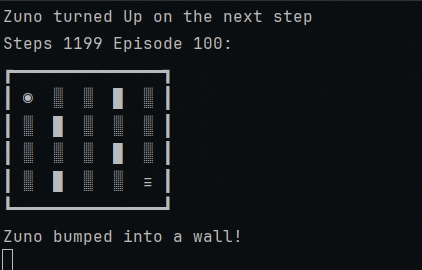
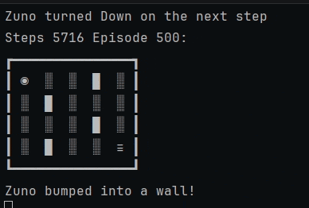
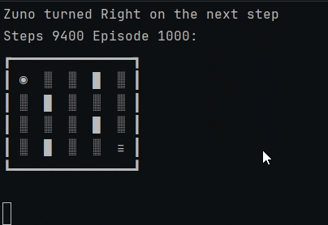

# Zuno
---

Zuno is a small robot that wakes up in the corner of a junkyard with
a limited charge. Somewhere in the maze is a battery. Zuno doesn't 
know where, or even that wall exist. It learn by trying things.

This is tabular Q-learning agent written in Rust, drawn in the terminal
with ASCII. I built it as a hobby project to understand how reinforcement
learning works.

---
### Watching Zuno learn
Each clip is real run, drawn one step every 0.5 seconds.
`◉` is Zuno, `█` is a wall, `≡` is the battery.

Episode 1-5:

Episode 50-55:

Episode 500-505:

Final run:

At the final run, Zuno goes straight to the battery in 7 steps, the shortest\
possible route.

---
### How it learns
**The state.** Zuno's situation is described by two things: which cell it's in
(the maze is 4×5, so 20 cells, with 4 inner walls) and how much charge it has left
(13 levels). That gives 260 states.

**The Q-Table**. For every state and each of the four moves (Up, Right, Down, Left),
Zuno keeps a number: how good it expects that move to be from that state.

**Rewards**. Every steps cost 1 charge, so wasting time is bad. Bumping wall cost -3.0,
more than a normal step -1.0. Running out of charge is worse at -5.0. Reaching the battery
pays a big reward, +10.0.

**Epsilon greedy**. Most of the time Zuno picks the move with the highest value (exploitation),
but with epsilon it tries a random move (exploration). Without exploring, Zuno would never 
discover better routes.

**The update**. After each move, Zuno nudges the value of the move it just made toward the reward 
it got plus the best value of where it ended up (discounted). Over many episodes, value spreads
backward from the battery along the route that leads to it. Settings: learning rate 0.1, discount 0.8.

**Epsilon decay**. Epsilon started constant, then I made it decay per episode: a lot of exploration 
early, very little at the end.
